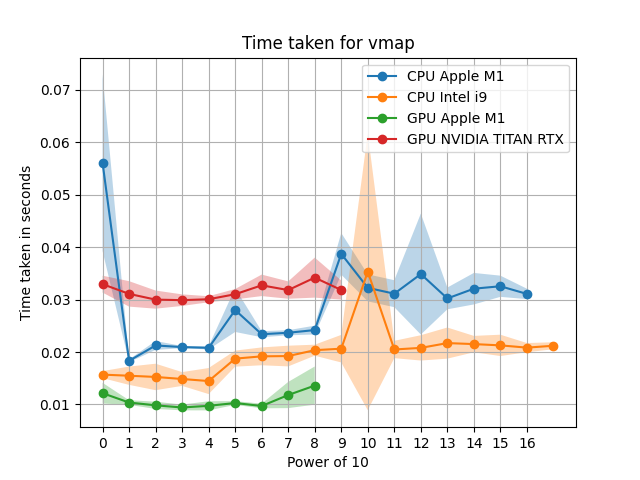

Some simple examples to learn the functionality of JAX and just-in-time (JIT).

This is useful for MuJoCo-MJX https://mujoco.readthedocs.io/en/stable/mjx.html

### Performance Apple M1 vs NVIDIA TITAN RTX

